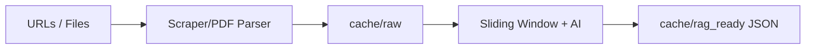
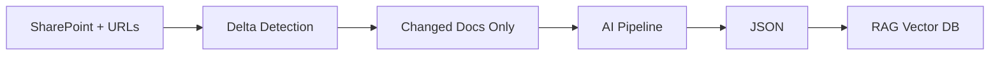

# RPP - RAG Preparation Pipeline

A modular pipeline for scraping, parsing, and processing content into RAG-ready JSON artifacts.

**Production:** `https://rag-scrape-pipeline-974351967139.us-west1.run.app`
**Local:** `http://localhost:9090`
**Source:** https://github.com/susom/rag_scrape_pipeline

## Features

- **Web API** with HTML UI for interactive processing
- **URL scraping** (HTML snapshots, main content extraction, PDF/DOCX attachment detection)
- **Batch document upload** (multiple PDF, DOCX, TXT files in one operation)
- **Link following**:
  - Web URLs: Follow PDF/DOCX attachments in main content
  - Uploaded docs: Extract and scrape web links - supports both HTML and PDF URLs (optional, 1 level deep, rate-limited)
- **Source-aware AI extraction**:
  - **Web pages**: Remove structural cruft (nav, ads, scripts), preserve policy content
  - **Uploaded docs**: Conservative preservation of all substantive content
  - **Critical**: Preserves metadata labels and dry regulatory language
- **AI-powered content filtering** via SecureChatAI gateway
- **Multi-model support** (GPT-4.1, Claude, Gemini, Llama, DeepSeek, etc.)
- **PDF parsing** (via `pdfplumber`)
- **Local caching** (`cache/raw` for raw HTML/PDF text)
- **Sliding window processing** with deduplication
- **Canonical JSON output** (`cache/rag_ready/{run_id}.json`)
- **GCS storage** integration (optional)
- **SharePoint integration** (input/output storage, automation)
- **Automated ingestion** (cron-triggered, delta detection, vector cleanup)
- **Database tracking** (Cloud SQL / MySQL — document state, ingestion history, distributed locks)
- **CI/CD deployment** (auto-deploy on git push)

---

## Pipeline Flow

**Manual (Web UI / CLI):**


**Automated (Cron):**


---

## Quick Start

1. Clone the repo
2. Create `.env` with your credentials:
   ```env
   REDCAP_API_URL=https://your-redcap-instance/api/
   REDCAP_API_TOKEN=your_token_here
   GCS_BUCKET=your-bucket-name  # optional
   ```
3. Build and run:
   ```bash
   docker-compose build
   docker-compose up
   ```
4. Open `http://localhost:9090` in your browser

---

## Usage

### Web API (Primary)

Start the server and visit `http://localhost:9090`:
```bash
docker-compose up
```

The web UI allows you to:
- **Process URLs**: Enter web URLs with optional PDF/DOCX attachment following
- **Upload documents**: PDF, DOCX, TXT files (batch upload supported)
- **Follow web links in documents**: Optional checkbox to extract and scrape URLs found in uploaded files (1 level deep)
  - ⚠️ Large batches with link following can take 30-60+ minutes
  - UI warns when uploading >3 files with link following enabled
  - Server timeout: 2 hours (sufficient for very large batches)
- **Configure prompts**: Customize AI extraction behavior
- **Select AI model**: Choose from multiple available models

### API Endpoints

**POST /run** - Process URLs
```bash
curl -X POST http://localhost:9090/run \
  -H "Content-Type: application/json" \
  -d '{"urls": ["https://example.com"], "follow_links": true}'
```

Response:
```json
{
  "status": "completed",
  "run_id": "rpp_2026-01-06T18-30-00Z_a1b2c3d4",
  "output_path": "cache/rag_ready/rpp_2026-01-06T18-30-00Z_a1b2c3d4.json",
  "stats": {"documents_processed": 1, "total_sections": 5, ...},
  "warnings": []
}
```

**POST /upload** - Upload and process documents
```bash
curl -X POST http://localhost:9090/upload \
  -F "files=@document.docx" \
  -F "follow_doc_links=true" \
  -F "model=gpt-4.1"
```
Parameters:
- `files`: One or more files (PDF, DOCX, TXT)
- `follow_doc_links`: Extract and scrape URLs found in documents (optional, default: false)
  - Max 20 URLs per document, 2-second delay between requests (rate limiting)
- `model`: AI model to use (optional)

**GET /download/{run_id}** - Download JSON output for a run

**GET /health** - Health check

**POST /api/ingest-batch** - Automated batch ingestion (cron-triggered)
```bash
curl -X POST "http://localhost:9090/api/ingest-batch?dry_run=true"
```
Query params:
- `force_reprocess`: Ignore hashes, reprocess all documents (default: false)
- `document_ids`: Comma-separated list of specific document IDs
- `dry_run`: Report changes without ingesting (default: false)

Response:
```json
{
  "status": "completed",
  "run_id": "ingest_2026-02-17T10-30-00Z",
  "summary": {
    "documents_processed": 12,
    "sections_ingested": 143,
    "documents_skipped": 45,
    "documents_failed": 2,
    "processing_time_seconds": 120.5
  },
  "errors": [],
  "dry_run": false
}
```

### CLI

Run the pipeline from command line:
```bash
docker-compose run --rm scraper python -m rag_pipeline.main
```

---

## Output Format

RPP produces a single canonical JSON file per run at `cache/rag_ready/{run_id}.json`.

Schema version: `rpp.v1`

```json
{
  "schema_version": "rpp.v1",
  "rpp_version": "0.2.0",
  "run": {
    "run_id": "rpp_2026-01-06T18-30-00Z_a1b2c3d4",
    "timestamp_start": "2026-01-06T18:30:00Z",
    "timestamp_end": "2026-01-06T18:32:15Z",
    "triggered_by": "web_api",
    "run_mode": "deterministic",
    "follow_links": true,
    "tags": []
  },
  "documents": [...],
  "aggregate_stats": {...},
  "warnings": [...]
}
```

---

## Project Structure

```text
.
├── cache/
│   ├── raw/           # raw scraped HTML/PDF text
│   └── rag_ready/     # canonical JSON output
├── config/
│   ├── urls.txt       # default URL list
│   └── sliding_window_prompts.json
├── docker-compose.yml
├── Dockerfile
├── requirements.txt
├── README.md
├── CLAUDE.md
└── rag_pipeline/
    ├── web.py              # FastAPI web interface + /api/ingest-batch
    ├── main.py             # CLI entrypoint + run_pipeline()
    ├── cli.py              # Interactive CLI
    ├── output_json.py      # Canonical JSON writer
    ├── scraping/
    │   ├── scraper.py
    │   └── pdf_parser.py
    ├── processing/
    │   ├── ai_client.py         # SecureChatAI proxy
    │   ├── sliding_window.py
    │   └── text_extraction.py   # Shared file→text (PDF/DOCX/TXT)
    ├── automation/
    │   ├── orchestrator.py      # Cron ingestion workflow
    │   ├── content_fetcher.py   # SharePoint + URL fetching
    │   ├── sharepoint_client.py # Microsoft Graph API
    │   ├── rag_client.py        # REDCap RAG EM API
    │   └── locking.py           # Distributed lock
    ├── database/
    │   ├── models.py            # SQLAlchemy models
    │   └── migrations/          # Schema migrations
    ├── storage/
    │   └── storage.py
    └── utils/
        └── logger.py
```

---

## Environment Variables

| Variable | Required | Description |
|----------|----------|-------------|
| `REDCAP_API_URL` | Yes | REDCap API endpoint for SecureChatAI |
| `REDCAP_API_TOKEN` | Yes | REDCap API token |
| `GCS_BUCKET` | No | GCS bucket for artifact upload |
| `STORAGE_MODE` | No | `local` (default) or `gcs` |
| `SHAREPOINT_TENANT_ID` | For automation | Azure AD tenant ID |
| `SHAREPOINT_CLIENT_ID` | For automation | App registration client ID |
| `SHAREPOINT_CLIENT_SECRET` | For automation | App registration secret |
| `SHAREPOINT_SITE_URL` | For automation | SharePoint site URL |

---

## Production Deployment (Cloud Run)

**⚠️ CRITICAL:** When deploying to Cloud Run, you must increase the request timeout from the default 5 minutes to 60 minutes to support link-following operations.

**Via Google Cloud Console:**
1. Go to Cloud Run → Select your service
2. "Edit & Deploy New Revision" → "Container" tab
3. Set "Request timeout" to **3600** seconds
4. Deploy

**Via gcloud CLI:**
```bash
gcloud run services update YOUR_SERVICE_NAME --timeout=3600 --region=YOUR_REGION
```

Without this change, link-following operations on large batches will timeout and fail.

---

## Recent Updates

### Bug Fixes (2026-01-14)

**Problem:** Followed web links were being skipped, causing content loss for Stanford policy pages.

**Root Causes:**
1. Field name typo in validation logic (`content` vs `text`)
2. Over-aggressive AI prompts removing dry regulatory language
3. Missing metadata label preservation

**Fixes:**
1. ✅ Fixed field name in content validation (web.py, main.py)
2. ✅ Updated AI prompts to explicitly preserve policy content and metadata labels
3. ✅ Migrated to source-type-specific prompts (WebPage, DOCX, PDF, default)
4. ✅ Added web link following to core pipeline (main.py)

**Impact:** Followed URLs now correctly preserve Stanford policy content.

**Files Modified:**
- `rag_pipeline/web.py` - Fixed validation, preserved AI processing for followed links
- `rag_pipeline/processing/sliding_window.py` - Updated default prompts
- `rag_pipeline/main.py` - Added "web" follow mode
- `config/sliding_window_prompts.json` - Nested structure with source-specific prompts

---

## AI Extraction Philosophy

The pipeline uses **source-type-aware extraction** to apply the right level of filtering:

**Web Pages (URL scraping):**
- ✅ **PRESERVE:** All policy content (even if dry/formal), metadata labels
- ❌ **REMOVE:** Navigation, menus, headers, footers, ads, scripts, exact duplicates
- Note: "Boilerplate" terminology removed - regulatory language is NOT boilerplate

**Uploaded Documents (DOCX, PDF, TXT):**
- ✅ **PRESERVE:** ALL substantive content, references, citations, links, tables, metadata labels
- ❌ **REMOVE ONLY:** Format artifacts, OCR errors, page numbers, corrupted characters

**Followed Web Links:**
- Process with "WebPage" prompts (same as URL scraping)
- Rate limited: max 20 URLs per document, 2-second delay

**Prompts:** Configured in `config/sliding_window_prompts.json` with nested structure.

---

## SharePoint Integration & Automated Ingestion

The pipeline fetches content from SharePoint and ingests it into the RAG vector database on a cron schedule.

**Input Sources (via Microsoft Graph API):**
- **Document manifest**: DOCX, PDF, TXT files from a configured SharePoint folder
- **External URLs page**: A SharePoint page containing links to scrape

**Automated Workflow (`POST /api/ingest-batch`):**
1. Acquire distributed lock (prevents concurrent runs)
2. Fetch document manifest + external URLs from SharePoint
3. Delta detection (SP files: timestamp from Graph API; URLs: content hash)
4. Process changed documents through AI pipeline
5. Ingest sections into RAG vector database (Pinecone via REDCap EM API)
6. Clean up stale vectors on re-ingestion

**Database Tracking (Cloud SQL / MySQL):**
- `document_ingestion_state` table: content hash, vector IDs, ingestion status, retry counts
- `ingestion_locks` table: distributed locking across Cloud Run instances
- Migrations in `rag_pipeline/database/migrations/`

**Benefits:**
- Only changed documents are re-processed (hash-based delta detection)
- Full vector cleanup on re-ingestion (no orphaned vectors)
- Failure-safe: partial failures keep old vectors intact
- Distributed locking prevents duplicate processing

---

## Run Modes

| Mode | Description |
|------|-------------|
| `ai_always` | Every chunk passes through AI normalization (recommended) |
| `deterministic` | Pure text extraction, no AI calls |
| `ai_auto` | AI triggered by noise detection heuristics |

---

## Deployment

**CI/CD:** Automated via GitHub Actions
```
git push → GitHub Actions → Docker build → Cloud Run deployment
```

**Repository:** https://github.com/susom/rag_scrape_pipeline

**Production URL:** https://rag-scrape-pipeline-974351967139.us-west1.run.app

**Rollback:** Revert commit or redeploy specific tag via Cloud Run console
