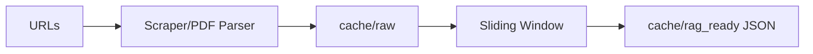

# CRAPP - Content RAG Preparation Pipeline

A modular pipeline for scraping, parsing, and processing content into RAG-ready JSON artifacts.

**Primary Interface: Web API** at `localhost:9090`

## Features

- Web API with HTML UI for interactive processing
- URL scraping (HTML snapshots, main content extraction, PDF detection)
- PDF parsing (via `pdfplumber`)
- Local caching (`cache/raw` for raw HTML/PDF text)
- Sliding window processing via SecureChatAI (REDCap proxy)
- Deduplication & canonical JSON output (`cache/rag_ready`)
- GCS storage integration (optional)
- Modular design (`rag_pipeline/` package with submodules)

---

## Pipeline Flow



---

## Quick Start

1. Clone the repo
2. Create `.env` with your credentials:
   ```env
   REDCAP_API_URL=https://your-redcap-instance/api/
   REDCAP_API_TOKEN=your_token_here
   GCS_BUCKET=your-bucket-name  # optional
   ```
3. Build and run:
   ```bash
   docker-compose build
   docker-compose up
   ```
4. Open `http://localhost:9090` in your browser

---

## Usage

### Web API (Primary)

Start the server and visit `http://localhost:9090`:
```bash
docker-compose up
```

The web UI allows you to:
- Enter URLs to process
- Configure prompts
- Toggle link-following
- Upload documents (PDF, DOCX, TXT)

### API Endpoints

**POST /run** - Process URLs
```bash
curl -X POST http://localhost:9090/run \
  -H "Content-Type: application/json" \
  -d '{"urls": ["https://example.com"], "follow_links": true}'
```

Response:
```json
{
  "status": "completed",
  "run_id": "crapp_2026-01-06T18-30-00Z_a1b2c3d4",
  "output_path": "cache/rag_ready/crapp_2026-01-06T18-30-00Z_a1b2c3d4.json",
  "stats": {"documents_processed": 1, "total_sections": 5, ...},
  "warnings": []
}
```

**POST /upload** - Upload and process a document

**GET /health** - Health check

### CLI

Run the pipeline from command line:
```bash
docker-compose run --rm scraper python -m rag_pipeline.main
```

---

## Output Format

CRAPP produces a single canonical JSON file per run at `cache/rag_ready/{run_id}.json`.

Schema version: `crapp.v1`

```json
{
  "schema_version": "crapp.v1",
  "crapp_version": "0.2.0",
  "run": {
    "run_id": "crapp_2026-01-06T18-30-00Z_a1b2c3d4",
    "timestamp_start": "2026-01-06T18:30:00Z",
    "timestamp_end": "2026-01-06T18:32:15Z",
    "triggered_by": "web_api",
    "run_mode": "deterministic",
    "follow_links": true,
    "tags": []
  },
  "documents": [...],
  "aggregate_stats": {...},
  "warnings": [...]
}
```

---

## Project Structure

```text
.
├── cache/
│   ├── raw/           # raw scraped HTML/PDF text
│   └── rag_ready/     # canonical JSON output
├── config/
│   ├── urls.txt       # default URL list
│   └── sliding_window_prompts.json
├── docker-compose.yml
├── Dockerfile
├── requirements.txt
├── README.md
├── CLAUDE.md
└── rag_pipeline/
    ├── web.py              # FastAPI web interface (primary)
    ├── main.py             # CLI entrypoint + run_pipeline()
    ├── cli.py              # Interactive CLI
    ├── output_json.py      # Canonical JSON writer
    ├── scraping/
    │   ├── scraper.py
    │   └── pdf_parser.py
    ├── processing/
    │   ├── ai_client.py    # SecureChatAI proxy
    │   └── sliding_window.py
    ├── storage/
    │   └── storage.py
    └── utils/
        └── logger.py
```

---

## Environment Variables

| Variable | Required | Description |
|----------|----------|-------------|
| `REDCAP_API_URL` | Yes | REDCap API endpoint for SecureChatAI |
| `REDCAP_API_TOKEN` | Yes | REDCap API token |
| `GCS_BUCKET` | No | GCS bucket for artifact upload |
| `STORAGE_MODE` | No | `local` (default) or `gcs` |

---

## Run Modes

| Mode | Description |
|------|-------------|
| `deterministic` | Pure text extraction, no AI calls (default) |
| `ai_auto` | AI triggered by noise detection heuristics |
| `ai_always` | Every chunk passes through AI normalization |
