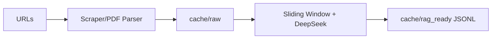
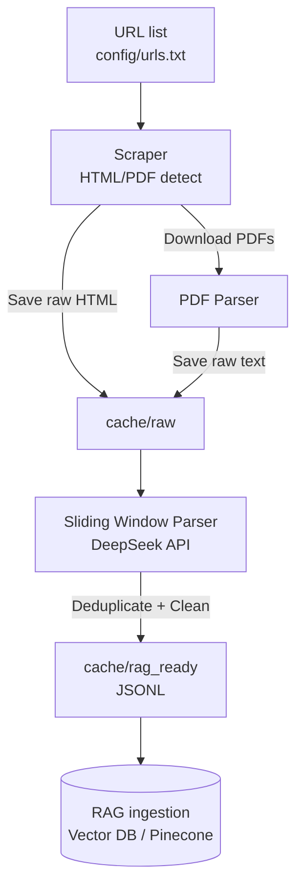

# RAG Content Ingestion Pipeline

A modular pipeline for scraping, parsing, and processing content into JSONL suitable for Retrieval-Augmented Generation (RAG) ingestion.

## Features

- 🌐 URL scraping (HTML snapshots, main content extraction, PDF detection)
- 📄 PDF parsing (via `pdfplumber`)
- 💾 Local caching (`cache/raw` for raw HTML/PDF text)
- 🧠 Sliding window processing with DeepSeek (`deepseek-reasoner`)
- ✅ Deduplication & JSONL output (`cache/rag_ready`)
- 🔧 Modular design (`rag_pipeline/` package with submodules)

### Coming Soon
- ☁️ GCS storage integration
- 📦 Automated Pinecone ingestion
- ⏰ Cloud Scheduler for periodic refresh

---

## Pipeline Flow

---

## Quick Start Flow



## Detailed Pipeline Flow



---

## Project Structure

```text
.
├── cache/
│   ├── raw/           # raw scraped HTML/PDF text
│   └── rag_ready/     # processed JSONL output
├── config/
│   └── urls.txt       # list of target URLs
├── docker-compose.yml
├── Dockerfile
├── requirements.txt
├── README.md
└── rag_pipeline/
    ├── cli.py
    ├── main.py
    ├── scraping/
    │   ├── scraper.py
    │   └── pdf_parser.py
    ├── processing/
    │   ├── ai_client.py
    │   └── sliding_window.py
    ├── storage/
    │   └── storage.py
    └── utils/
        └── logger.py
```

---

## Setup

1. Clone the repo
2. Create `.env` with your DeepSeek key:
   ```env
   DEEPSEEK_API_KEY=your_key_here
   ```
3. Build the image:
   ```bash
   docker-compose build
   ```

---

## Usage

### Interactive CLI
Run the CLI to select a URL or run all:

```bash
docker-compose run --rm
```

### Direct Orchestration
Run the whole pipeline on all URLs in `config/urls.txt`:

```bash
docker-compose run --rm python -m rag_pipeline.main
```

Run it on a single URL:

```bash
docker-compose run --rm python -m rag_pipeline.main https://example.com/page
```

---

## Example Output

Example JSONL (`cache/rag_ready/irb_manual.jsonl`):

```json
{"text": "Informed consent requires disclosure of risks and benefits..."}
{"text": "Investigators must maintain accurate and complete study records..."}
{"text": "IRB review ensures compliance with federal regulations..."}
```
